# Board Bring-Up e Validação de Protótipo Eletrônico Embarcado
## Plataforma de Instrumentação e Controle Baseada no MCU NXP LPC11U14F (ARM Cortex-M0)

[](https://developer.arm.com/Processors/Cortex-M0)
[](https://www.nxp.com/)
[](https://kicad.org/)
[](https://en.wikipedia.org/wiki/C_(programming_language))
[](https://jlcpcb.com/)
[](LICENSE)

Este repositório reúne a documentação técnica integral, os projetos de engenharia eletrônica (esquemático elétrico, layout de PCI de 2 camadas e modelos 3D desenvolvidos no KiCad 9) e o firmware embarcado modular em linguagem C (bare-metal) estruturado em **Máquina de Estados Finitos (FSM)** para validação física e *board bring-up* de uma placa com o microcontrolador **NXP LPC11U14F** (núcleo ARM Cortex-M0).

O projeto foi concebido e implementado no âmbito da disciplina **PBLE02 (Projeto Baseado em Laboratório de Engenharia / Projeto de Hardware e Firmware)** do **Instituto de Engenharia de Sistemas e Tecnologia da Informação (IESTI)** da **Universidade Federal de Itajubá (UNIFEI)**, sob a orientação do **Prof. Dr. Rodrigo Maximiano Antunes de Almeida**.

---

## Equipe do Projeto (Grupo 1)

| Integrante | Matrícula |
| :--- | :---: |
| **Leonardo Mendonça Costa** | `2024001025` |
| **Fabricio Augusto Antonio** | `2025000031` |
| **Pedro Henrique Oliveira Francisco** | `2022003245` |
| **Luis Gustavo Ribeiro Chacon** | `2025004890` |

**Agradecimentos Institucionais:**
À equipe técnica de laboratório do IESTI/UNIFEI, em especial aos técnicos em eletrônica **José Anderson Reis** e **Nedson Joaquim Maia**, pelo auxílio instrumental de bancada, suporte de montagem e retrabalho de protótipos; e ao **Prof. Dr. Rodrigo Maximiano Antunes de Almeida** pelas orientações e direcionamento técnico durante a validação experimental.

---

## Visão Geral da Placa de Circuito Impresso (PCB)

A placa física foi projetada respeitando dimensões compactas de $80 \times 80\text{ mm}^2$ em substrato de fibra de vidro FR-4 de duas camadas condutivas, espessura de 1,6 mm, acabamento superficial HASL com chumbo, máscara de solda verde e serigrafia branca, fabricada pela JLCPCB.

| Face Superior 3D (Revisão Final Corrigida) | Face Inferior 3D (Plano de Terra Sólido) |
| :---: | :---: |
| 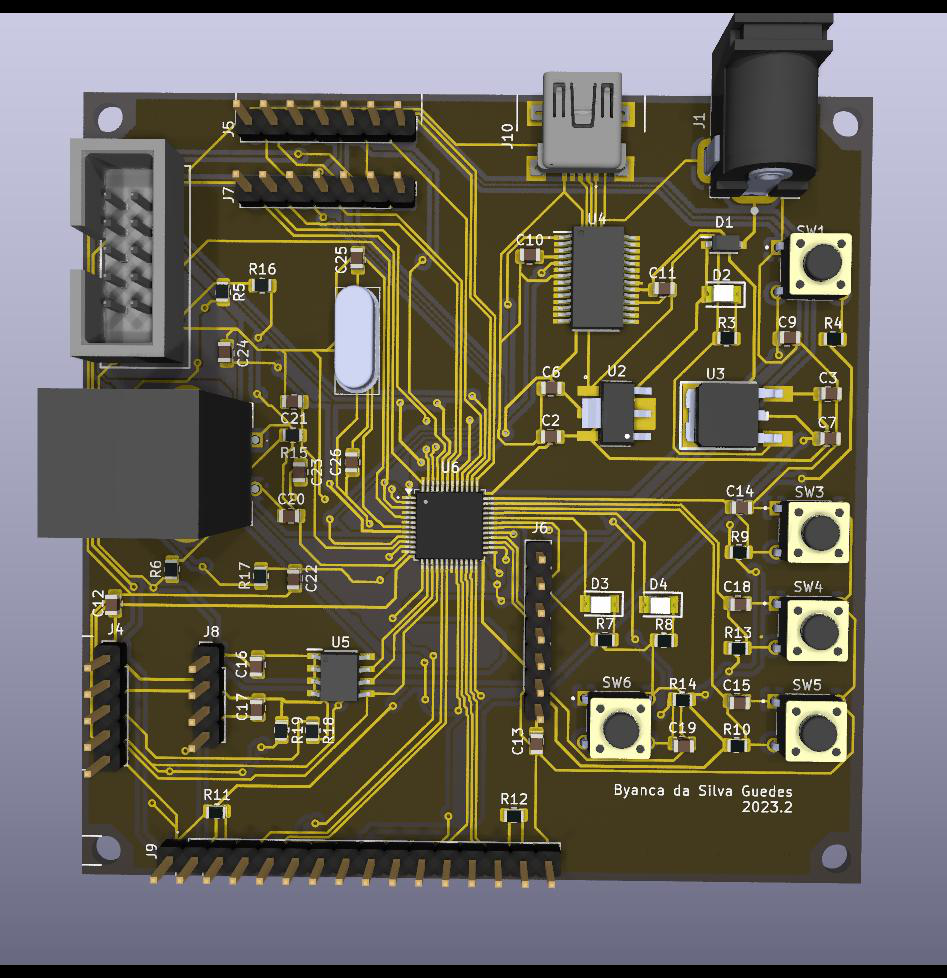 | 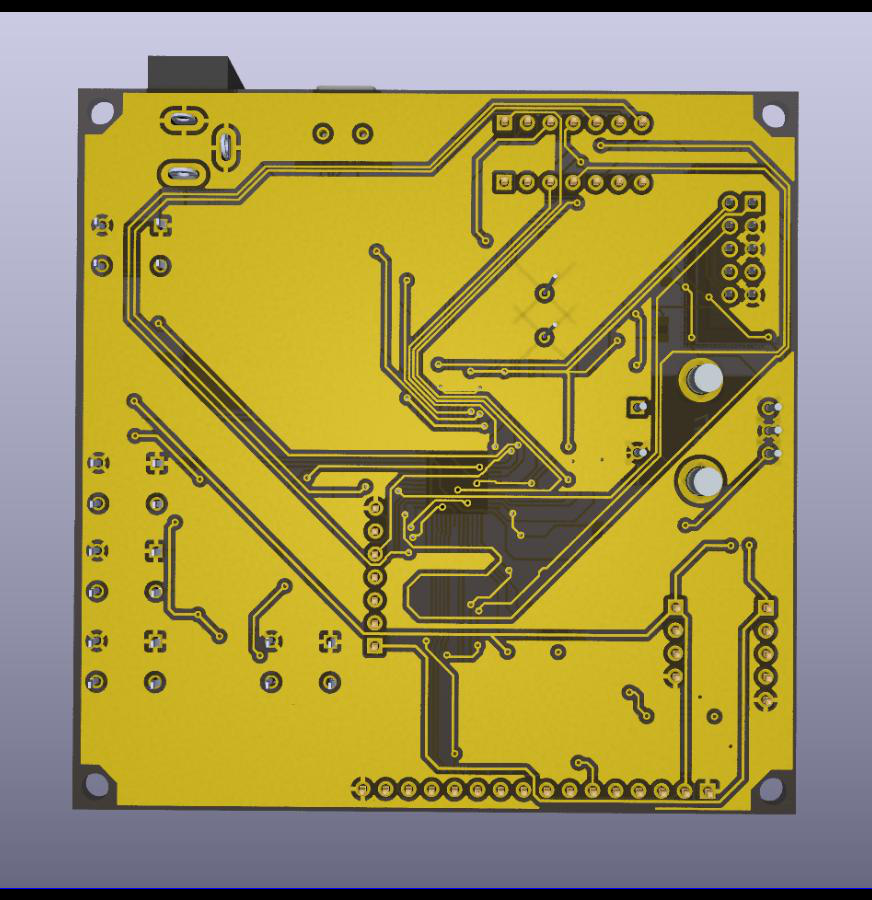 |

| Comparativo Histórico: Face Superior 3D Original |
| :---: |
| 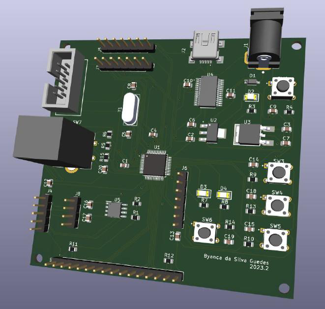 |

> **BOM Interativo (iBOM):** O repositório inclui a lista de materiais interativa gerada pelo plugin *Interactive HTML BOM*. Para navegar visualmente por cada componente, ilha e footprint na placa, abra em seu navegador o arquivo [`KiCad/Projeto_Final/bom/ibom.html`](KiCad/Projeto_Final/bom/ibom.html).

---

## Arquitetura de Hardware & Subcircuitos

O sistema é subdividido em 5 subsistemas funcionais integrados:

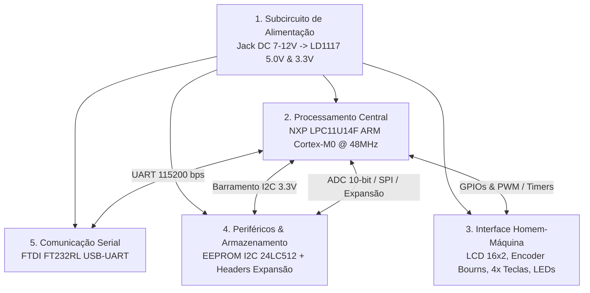
```mermaid
graph TD
    PS["1. Subcircuito de Alimentação<br/>Jack DC 7-12V -> LD1117 5.0V & 3.3V"] --> MCU["2. Processamento Central<br/>NXP LPC11U14F ARM Cortex-M0 @ 48MHz"]
    PS --> COMM["5. Comunicação Serial<br/>FTDI FT232RL USB-UART"]
    PS --> HMI["3. Interface Homem-Máquina<br/>LCD 16x2, Encoder Bourns, 4x Teclas, LEDs"]
    PS --> PERIPH["4. Periféricos & Armazenamento<br/>EEPROM I2C 24LC512 + Headers Expansão"]

    MCU <-->|"UART 115200 bps"| COMM
    MCU <-->|"Barramento I2C 3.3V"| PERIPH
    MCU <-->|"GPIOs & PWM / Timers"| HMI
    MCU <-->|"ADC 10-bit / SPI / Expansão"| PERIPH
```

### 1. Subcircuito de Alimentação
- **Entrada:** Conector Jack fêmea P4 (PJ-002A) compatível com fontes externas DC na faixa de **7V a 12V**.
- **Proteção:** Diodo Schottky `1N5819HW-7-F` em série para bloqueio contra inversão de polaridade e transientes.
- **Regulação Linear em Cascata:**
  - `LD1117DT50TR` (DPAK): Converte a tensão de entrada para o barramento de **5.0V DC** (alimentação do display LCD).
  - `LD1117S33TR` (SOT-223): Fornece **3.3V DC** regulados (para microcontrolador, transceptor USB e EEPROM).
- **Filtragem e Desacoplamento:** Associação de capacitores eletrolíticos de $10\ \mu\text{F}$ e cerâmicos multicamada X7R de $220\text{ nF}$ nas entradas e saídas. LED piloto indicador de barramento energizado com resistor limitador de $1\text{ k}\Omega$.

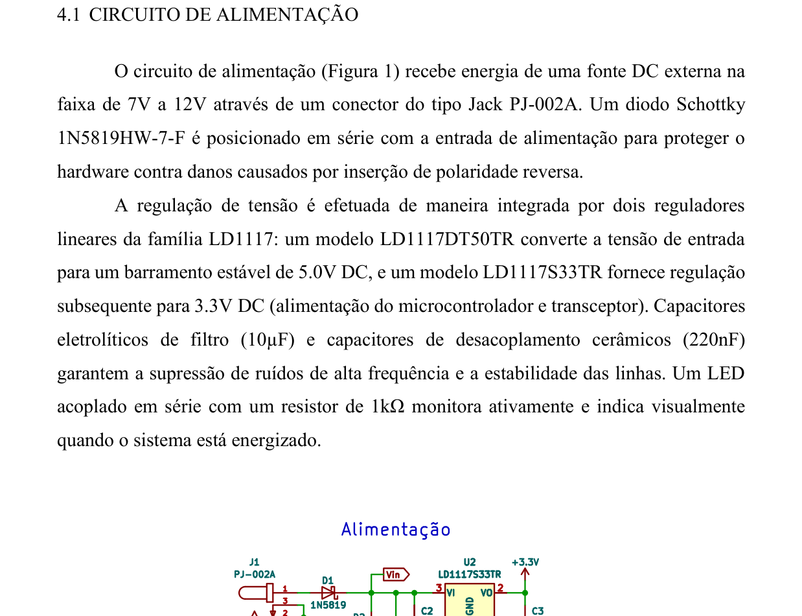

---

### 2. Subcircuito de Processamento
- **MCU:** NXP `LPC11U14F/201` em encapsulamento LQFP-48, núcleo ARM Cortex-M0 operando a até **48 MHz**, dotado de 32 KB de memória Flash, 6 KB de SRAM, 4 KB de EEPROM integrada e controlador USB full-speed.
- **Oscilador de Clock:** Cristal de quartzo de alta precisão de **12.000 MHz** (CTS ATS12A) associado a capacitores de carga externos dimensionados em **18 pF**.
- **Reset e Bootloader ISP:**
  - Reset mestre com botão táctil `SW1`, pull-up de $4.7\text{ k}\Omega$ e capacitor de debounce de $10\ \mu\text{F}$.
  - Chave de programação em sistema (ISP) `SW6` com pull-up, interligada ao pino oficial de bootloader `PIO0_1` (Pino 4).
- **Depuração / Programação:** Header SWD (*Serial Wire Debug*) com pinos `SWDIO` (Pino 39) e `SWDCLK` (Pino 29).

| Processamento Original (LPC1114) | Processamento Corrigido (LPC11U14F) |
| :---: | :---: |
| 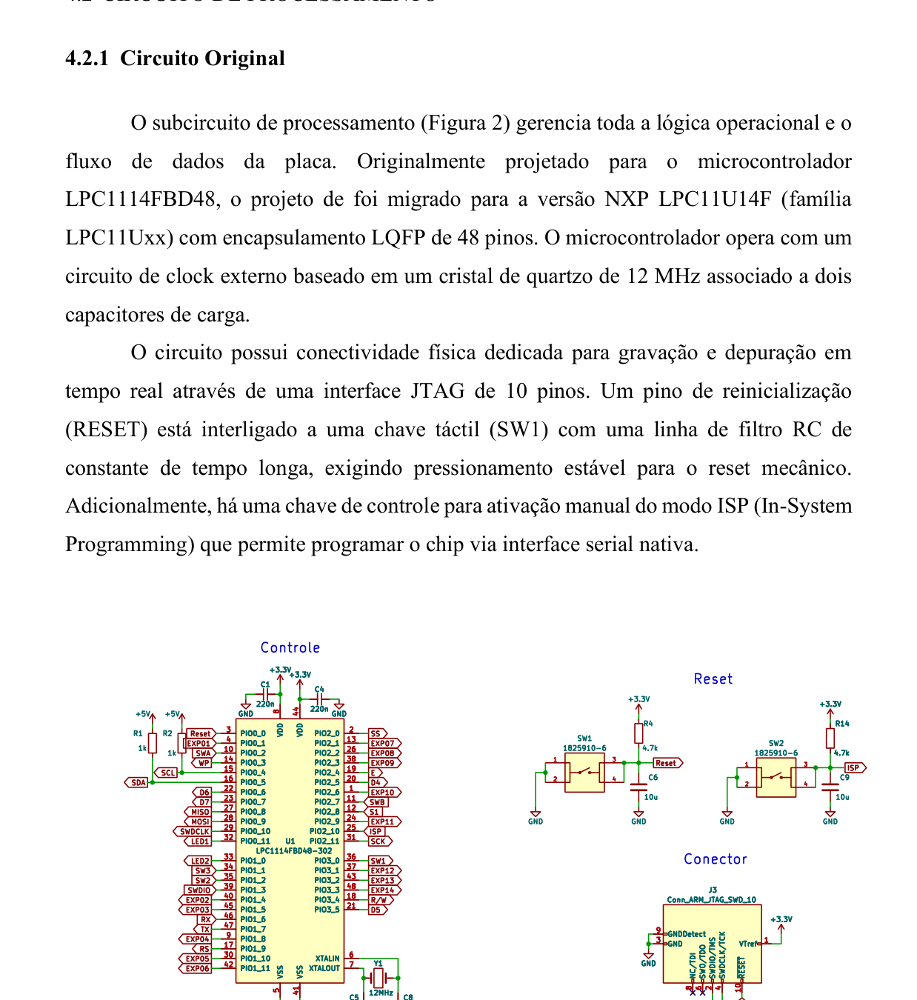 | 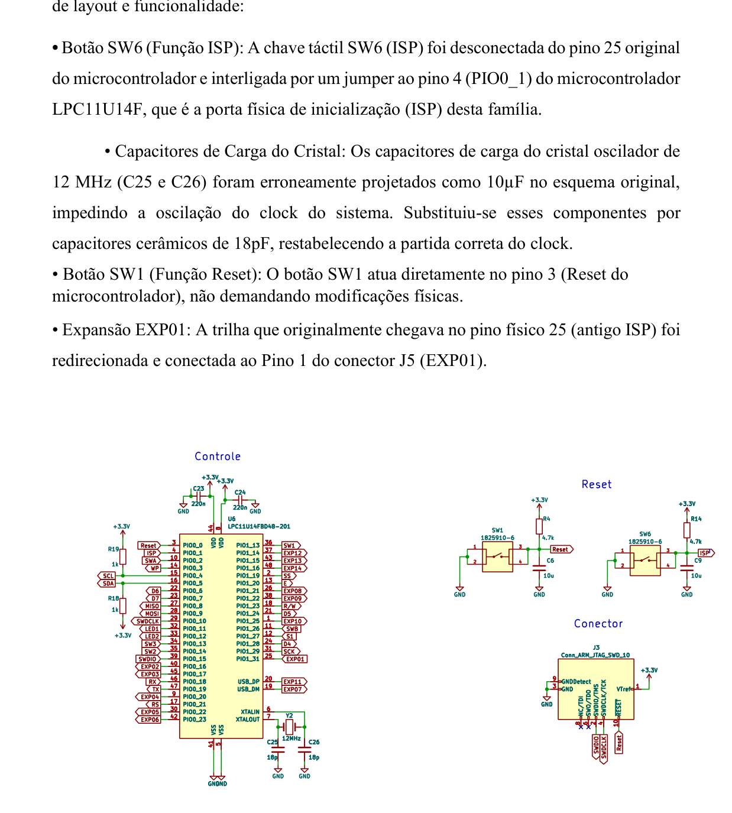 |

---

### 3. Subcircuito de Interação com o Usuário (IHM)
- **Display Alfanumérico:** LCD 16×2 (compatível com controlador HD44780 / JHD162A) operando em barramento paralelo de **4 bits** (`D4` a `D7`), com controle pelos sinais `RS`, `R/W` e `ENABLE`. Ajuste de contraste via trimpot de precisão de $10\text{ k}\Omega$.
- **Encoder Rotativo Incremental:** Bourns `PEC12R` com 24 pulsos por rotação, canais em quadratura A e B, botão de clique central e filtro RC passivo anti-ruído mecânico (*debounce*).
- **Teclado Táctil:** 4 chaves tácteis push-button (`SW2`, `SW3`, `SW4`, `SW5`) com resistores de pull-up de $10\text{ k}\Omega$.
- **Sinalizadores Visuais:** Três LEDs SMD (`D2`, `D3`, `D4`) acionados diretamente pelas saídas digitais do microcontrolador com resistores limitadores de $100\ \Omega$.

| Interação Original | Interação Corrigida (Ajuste de R e C) |
| :---: | :---: |
| 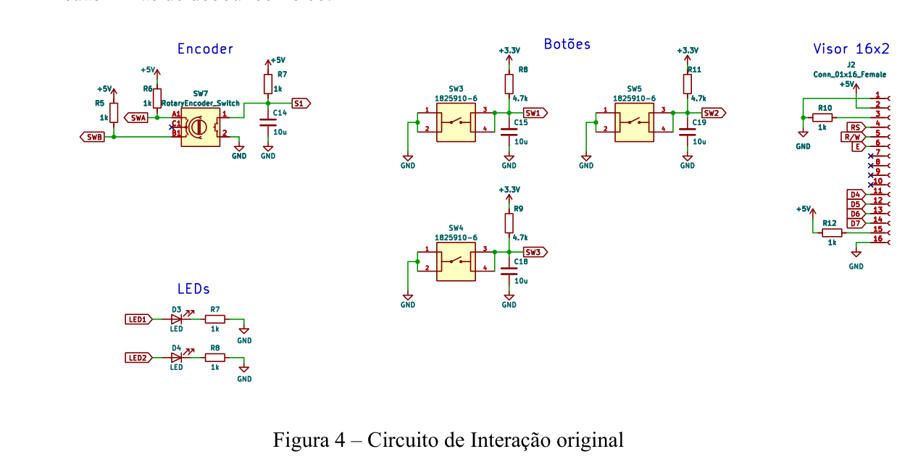 | 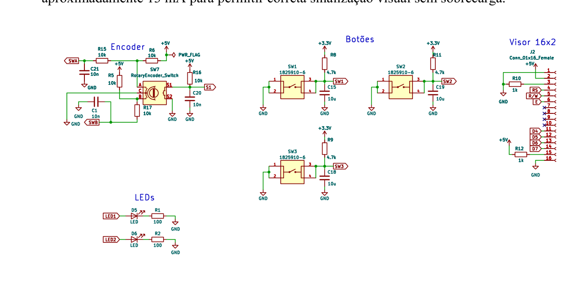 |

---

### 4. Subcircuito de Periféricos & Armazenamento
- **Memória EEPROM Externa:** Microchip `24LC512` (512 Kbit / 64 KByte) operando via barramento **I²C** com resistores de pull-up de $1\text{ k}\Omega$ polarizados em 3.3V.
- **Barramentos de Expansão:** Headers macho de passo 2.54 mm (`J4` a `J8`) expondo portas analógicas do ADC (10 bits), barramento SPI (`SCK`, `MISO`, `MOSI`, `SSEL`), alimentação e GPIOs livres.
- **Condicionamento de Sinal:** Canal de amplificação operacional para transdução de sinais analógicos externos com compensação de ganho em software (`GANHO_AMPOP`).

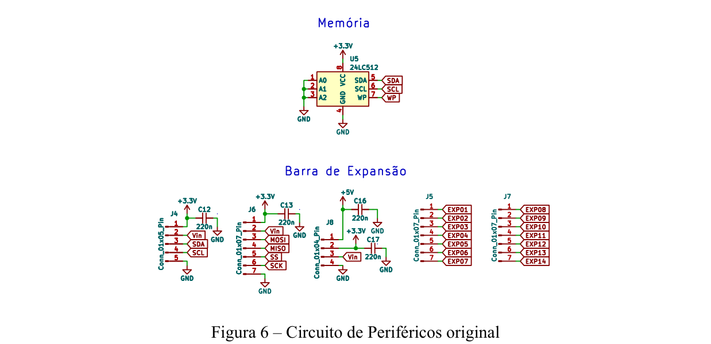

---

### 5. Subcircuito de Comunicação Serial
- **Transceptor USB-UART:** Chip dedicado FTDI `FT232RL` (SSOP-28) realizando a ponte entre o barramento USB da estação hospedeira e as portas seriais assíncronas do microcontrolador (`PIO0_18/RXD` e `PIO0_19/TXD`).
- **Conector Físico:** Porta Mini-USB Tipo B com filtragem e desacoplamento de alta frequência.

| Comunicação Original | Comunicação Corrigida (Isolamento VBUS) |
| :---: | :---: |
| 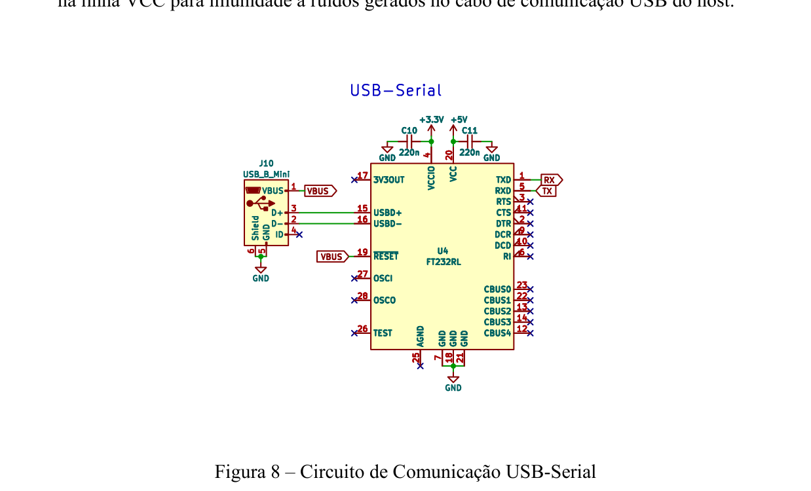 | 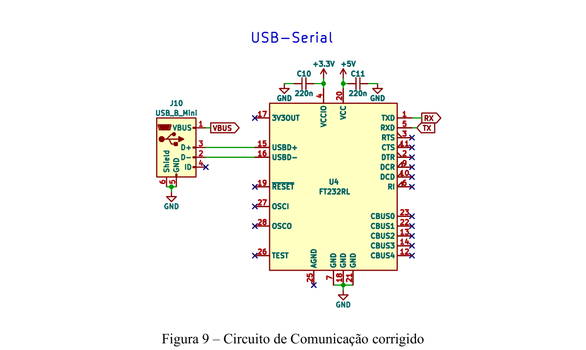 |

---

### Verificação de Regras Elétricas (ERC) e de Layout (DRC)
Durante o desenvolvimento no KiCad 9, a conformidade de conexões e fabricabilidade foi atestada:

| Esquema Elétrico ERC Original (Avisos) | Esquema Elétrico ERC Corrigido (0 Erros) |
| :---: | :---: |
| 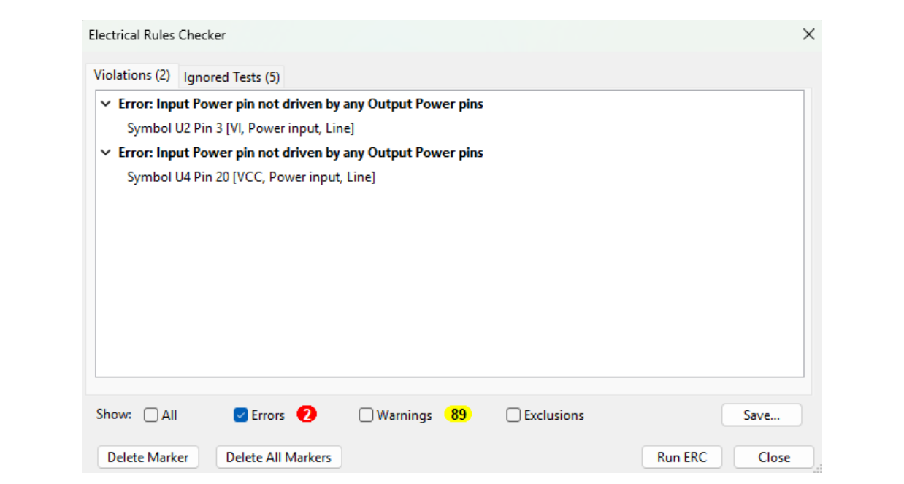 | 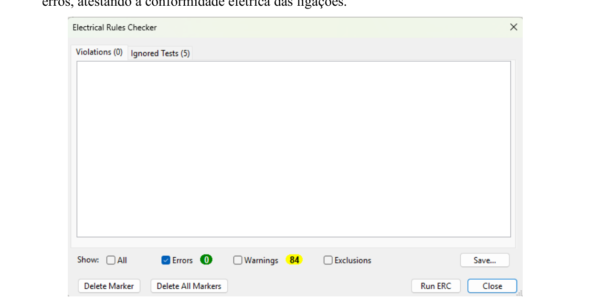 |

| DRC da Placa Original (Conflitos e Ilhas Isoladas) | DRC da Placa Corrigida (100% Validada) |
| :---: | :---: |
| 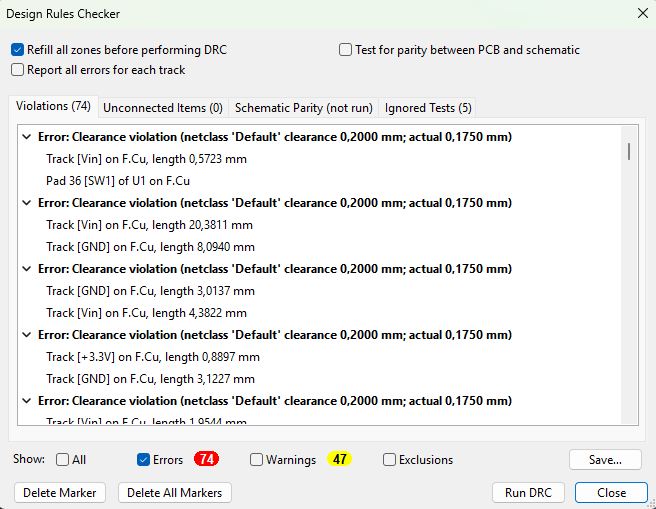 | 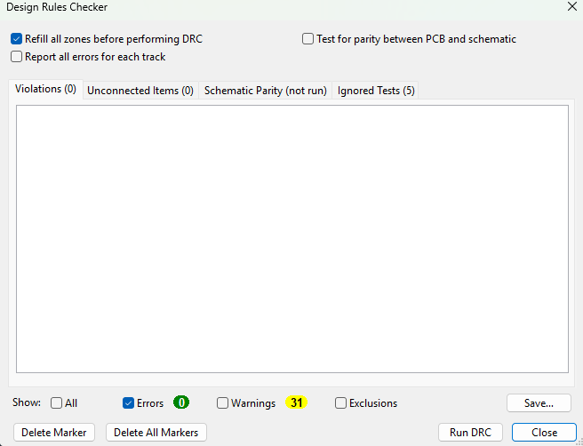 |

---

## Board Bring-Up: Modificações Físicas & Memorial de Cálculos

Durante a etapa prática de validação e *bring-up* em bancada com osciloscópio digital e multímetro de precisão, foram diagnosticadas discrepâncias no circuito original que demandaram **engenharia de retrabalho** (cortes de trilhas na PCI, soldagem de *jumpers* de precisão e readequação de componentes passivos).

### 1. Dimensionamento dos Capacitores de Carga do Cristal Oscilador (C25 e C26)
- **Problema Diagnosticado:** O esquemático original previa erroneamente capacitores de $10\ \mu\text{F}$ nas linhas `XTALIN` e `XTALOUT`. O excesso de reatância capacitiva aterrou os sinais de alta frequência e impediu qualquer ressonância do cristal de quartzo de 12 MHz, travando a inicialização do núcleo ARM.
- **Memorial de Cálculo da Capacitância Externa ($C_{ext}$):**
  O cristal de quartzo de 12 MHz (CTS ATS12A) especifica capacitância de carga nominal $C_L = 12\text{ pF}$. A capacitância parasita combinada das trilhas da PCI e pinos do chip é estimada em $C_s \approx 3\text{ pF}$. Como os dois capacitores de carga externos são idênticos ($C_1 = C_2 = C_{ext}$):
  $$C_L = \frac{C_1 \cdot C_2}{C_1 + C_2} + C_s = \frac{C_{ext}^2}{2 \cdot C_{ext}} + C_s = \frac{C_{ext}}{2} + C_s$$
  $$C_{ext} = 2 \cdot (C_L - C_s) = 2 \cdot (12\text{ pF} - 3\text{ pF}) = 2 \cdot 9\text{ pF} = \mathbf{18\text{ pF}}$$
- **Ação Realizada:** Substituição imediata dos capacitores $C_{25}$ e $C_{26}$ por cerâmicos C0G/NP0 de **18 pF**, viabilizando a oscilação estável do clock a 12 MHz.

---

### 2. Constante de Tempo do Filtro RC do Encoder Rotativo
- **Problema Diagnosticado:** O filtro RC do encoder `SW7` continha capacitores de $10\ \mu\text{F}$ com pull-ups de $10\text{ k}\Omega$, gerando constante de tempo $\tau = 100\text{ ms}$. Isso deformava os trens de pulso de quadratura durante giros normais, impossibilitando a leitura do sentido de rotação.
- **Memorial de Cálculo de Resposta em Frequência e Debounce:**
  Para filtrar o repique de contato mecânico (*bouncing*, típico de dezenas a centenas de microssegundos conforme Bourns) sem degradar giros manuais rápidos, os capacitores foram redimensionados para $C = 10\text{ nF}$:
  $$\tau = R \cdot C = (10 \times 10^3\ \Omega) \cdot (10 \times 10^{-9}\text{ F}) = 100\ \mu\text{s} = \mathbf{0.1\text{ ms}}$$
  A frequência de corte do filtro passa-baixas resultante é:
  $$f_c = \frac{1}{2 \cdot \pi \cdot R \cdot C} = \frac{1}{2 \cdot \pi \cdot 100\ \mu\text{s}} \approx \mathbf{1.59\text{ kHz}}$$
- **Ação Realizada:** Troca dos capacitores para **10 nF**, garantindo imunidade a repiques mecânicos e leitura instantânea de rotação em ambos os sentidos.

---

### 3. Tensão Lógica e Corrente de Dreno (Sink) no Barramento I²C
- **Problema Diagnosticado:** Os resistores de pull-up $R_1$ e $R_2$ ($1\text{ k}\Omega$) estavam conectados à malha de **5.0V**. Pela especificação oficial do protocolo I²C, a corrente de dreno em nível baixo ($I_{OL}$) em saídas open-drain não deve ultrapassar $3.0\text{ mA}$ para assegurar $V_{OL} \le 0.4\text{ V}$.
  $$I_{OL(5V)} = \frac{5.0\text{ V} - 0.4\text{ V}}{1\text{ k}\Omega} = \mathbf{4.6\text{ mA}} \quad (\text{Excede o limite normativo de 3 mA!})$$
- **Memorial de Cálculo com Alimentação Corrigida em 3.3V:**
  $$I_{OL(3.3V)} = \frac{3.3\text{ V} - 0.4\text{ V}}{1\text{ k}\Omega} = \mathbf{2.9\text{ mA}} \quad (< 3.0\text{ mA}, \text{em estrita conformidade})$$
- **Ação Realizada:** Corte da ilha de 5V e ligação por *jumper* dos resistores de pull-up $R_1$ e $R_2$ à tensão de 3.3V do pino 8 da EEPROM (U5).

---

### 4. Dimensionamento dos Resistores Limitadores dos LEDs (D2, D3, D4)
- **Problema Diagnosticado:** Com resistores originais de $1\text{ k}\Omega$ sob alimentação de 3.3V e queda direta $V_F = 2.0\text{ V}$ dos LEDs verdes Lite-On, a corrente era inexpressiva:
  $$I_{LED} = \frac{3.3\text{ V} - 2.0\text{ V}}{1\text{ k}\Omega} = \mathbf{1.3\text{ mA}}$$
- **Memorial de Cálculo para Corrente Nominal de Sinalização ($R_d$):**
  Para assegurar fluxo luminoso adequado com corrente de $\approx 13\text{ mA}$ (dentro do limite máximo de 40 mA por porta do LPC11U14F):
  $$R_d = \frac{V_{DD} - V_F}{I_{desejado}} = \frac{3.3\text{ V} - 2.0\text{ V}}{13\text{ mA}} = \frac{1.3\text{ V}}{0.013\text{ A}} = \mathbf{100\ \Omega}$$
- **Ação Realizada:** Instalação de resistores SMD de **100 Ω** (código 101).

---

### 5. Retrabalhos Físicos de Roteamento (Cortes e Jumpers)
1. **Migração LPC1114 -> LPC11U14F:** Adaptação da distribuição de pinos do microcontrolador e inclusão do header `LPC11Uxx.h` no firmware.
2. **LCD ENABLE (E):** Trilha cortada no pino 19 (`USB_DM`) e religada por *jumper* ao pino 13 (`PIO1_20`).
3. **LCD DATA 4 (DB4):** Trilha cortada no pino 20 (`USB_DP`) e religada por *jumper* ao pino 24 (`PIO1_28`).
4. **Tecla Bootloader ISP (SW6):** Desconectada do pino 25 e religada por *jumper* ao pino 4 (`PIO0_1`), pino de hardware que força a entrada no bootloader ISP ROM do LPC11U14F.
5. **Linha de Expansão EXP01:** Desviada para o pino 1 do conector `J5` (associada ao pino 25 `PIO1_31`).
6. **Proteção de Barramento USB (VBUS):** Corte da trilha que injetava 5V do conector Mini-USB no barramento da placa, eliminando circulação de corrente indesejada entre a fonte externa e o computador hospedeiro.

---

## Arquitetura de Software & Firmware Embarcado

O firmware foi desenvolvido em **C (padrão C99)** bare-metal para microcontroladores ARM Cortex-M0, estruturado em uma arquitetura orientada a eventos e baseada em uma **Máquina de Estados Finitos (FSM - Finite State Machine)** determinística.

### Diagrama UML da Arquitetura do Software
O design modular desacopla a camada de aplicação/controle da camada de drivers de baixo nível de hardware:

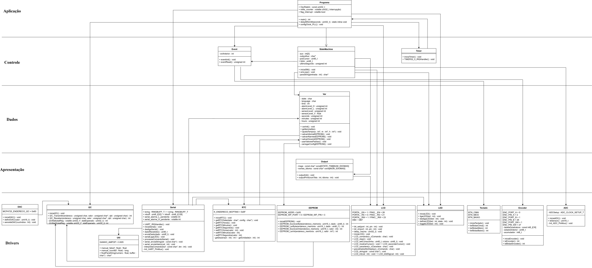

---

### Diagrama da Máquina de Estados Finitos (FSM)

A lógica central da aplicação é governada por estados mutuamente exclusivos que respondem a eventos gerados assincronamente pelo teclado, encoder, temporizadores ou recepção serial:

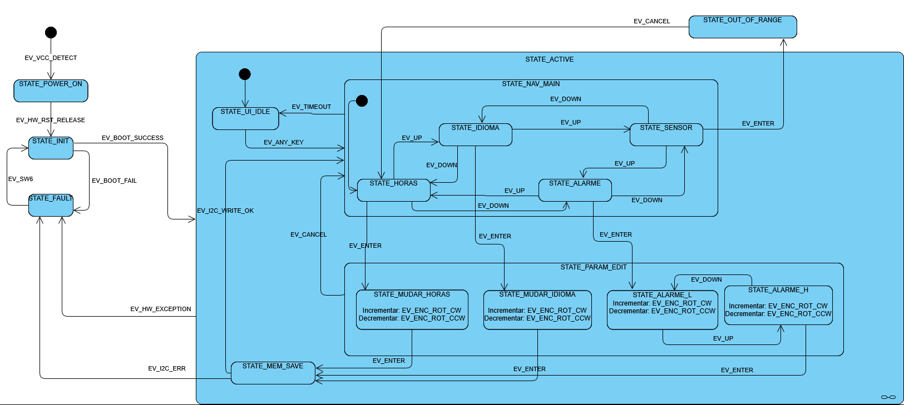

#### Tabela de Estados Principais:
| Estado | Descrição Funcional | Transições & Eventos |
| :--- | :--- | :--- |
| `STATE_INIT` | Inicialização dos periféricos (GPIO, I²C, UART, Timer, LCD), restauração dos parâmetros salvos na EEPROM. | Avança automaticamente para `STATE_NAV_MAIN`. |
| `STATE_NAV_MAIN` | Carrossel principal de menus: Horas, Alarme, Leitura do Sensor e Idioma. | `EV_UP` (SW5) / `EV_DOWN` (SW3) alternam os menus. `EV_ENTER` (SW4) acessa o modo de edição. |
| `STATE_HORAS` | Exibição em tempo real do relógio RTC no display LCD. | `EV_ENTER` desvia para `STATE_MUDAR_HORAS`. |
| `STATE_MUDAR_HORAS`| Edição de horas e minutos em memória RAM. | Rotação horária (`EV_ENC_ROT_CW`) ou anti-horária (`EV_ENC_ROT_CCW`) ajusta o valor. Clique do encoder (`EV_CANCEL`) cancela. `EV_ENTER` salva na EEPROM (`STATE_MEM_SAVE`). |
| `STATE_ALARME` | Monitoramento dos limites de disparo de alarme de janela (Low e High). | `EV_ENTER` acessa edição dos limites `STATE_ALARME_L` e `STATE_ALARME_H`. |
| `STATE_SENSOR` | Aquisição contínua do valor analógico pelo conversor A/D (10 bits) com conversão em tensão ($V$). | Se a leitura violar os limites configurados, dispara `EV_OUT_OF_RANGE`. |
| `STATE_OUT_OF_RANGE`| **Estado de Segurança:** Alerta visual com piscamento em alta prioridade de LEDs e mensagem no LCD indicando condição anômala. | O sistema trava o alerta até que a variável analógica retorne à faixa de tolerância. |
| `STATE_IDIOMA` | Exibição do idioma de interface ativo (Português / Inglês). | `EV_ENTER` desvia para `STATE_MUDAR_IDIOMA`. |
| `STATE_MEM_SAVE` | Executa a rotina de gravação não-volátil na EEPROM externa via barramento I²C. | Retorna para `STATE_NAV_MAIN` após sucesso. |
| `STATE_UI_IDLE` | Modo de economia de energia por inatividade de teclas e escurecimento de display (*backlight*). | Disparado por `EV_TIMEOUT`. Qualquer tecla (`EV_ANY_KEY`) acorda o sistema. |
| `STATE_FAULT` | Tratamento de falha crítica (erro de barramento I²C ou perda de integridade). | Recuperação via `SW1` (Reset de hardware). |

---

### Estrutura Modular do Código-Fonte (`Código/PBLE02/src/`)
- **`programa.c / .h`**: Ponto de entrada (`main`), rotinas de inicialização de clock e laço infinito (`smLoop` e `processaComandoSerial`).
- **`ctl/stateMachine.c / .h`**: Implementação da FSM, definição dos estados e lógica de transição.
- **`ctl/event.c / .h`**: Amostragem periódica de periféricos e fila circular de eventos (`EV_UP`, `EV_DOWN`, `EV_ENTER`, `EV_CANCEL`, etc.).
- **`ctl/timer.c / .h`**: Configuração da interrupção periódica SysTick (base de tempo de 1 ms).
- **`ctl/var.c / .h`**: Gestão de variáveis globais do sistema, strings de menu multilíngue e controle de alarmes.
- **`ctl/output.c / .h`**: Mapeamento das saídas visuais e atualização de display.
- **`hardware/LCD.c / .h`**: Driver de baixo nível para display alfanumérico HD44780 em barramento de 4 bits.
- **`hardware/ENCODER.c / .h`**: Decodificador de quadratura dos canais A/B do encoder Bourns.
- **`hardware/Teclado.c / .h`**: Varredura das teclas tácteis de navegação com debounce digital.
- **`hardware/EEPROM.c / .h` & `I2C.c / .h`**: Driver mestre I²C para leitura/gravação não-volátil de blocos na memória 24LC512.
- **`hardware/RTC.c / .h`**: Relógio de tempo real implementado por software com base no SysTick.
- **`hardware/Serial.c / .h`**: Driver assíncrono UART com buffer circular de recepção/transmissão e decodificador ASCII.
- **`hardware/ADC.c / .h` & `DAC.c / .h`**: Amostragem analógica de 10 bits e conversão D/A.
- **`hardware/LED.c / .h`**: Acionamento e controle de estados dos LEDs.

---

### Protocolo de Telemetria e Comandos Serial (UART @ 115200 bps)

O transceptor USB-Serial executa um *parser* de comandos ASCII permitindo tanto a consulta (*getters*) quanto a calibração remota de parâmetros (*setters*):

| Comando Serial | Direção | Formato da Resposta / Ação | Exemplo de Saída |
| :--- | :---: | :--- | :--- |
| `gettime` | Entrada | Retorna o horário atual do RTC interno | `#time=14:32:05#` |
| `getsensor` | Entrada | Retorna o valor raw do ADC (10 bits) e a tensão calibrada em Volts | `#sensor=0512/1.65V#` |
| `getalarmelow` | Entrada | Retorna o limiar inferior do alarme | `#alarmeLow=250#` |
| `getalarmehigh`| Entrada | Retorna o limiar superior do alarme | `#alarmeHigh=400#` |
| `alarmelow:<val>` | Entrada | Ajusta o limiar inferior e grava na EEPROM | `#alarmeLow=280#` |
| `alarmehigh:<val>`| Entrada | Ajusta o limiar superior e grava na EEPROM | `#alarmeHigh=420#` |
| `time:<hh>:<mm>:<ss>`| Entrada| Sincroniza o relógio RTC de software | `#time=09:15:00#` |
| `language:<0\|1>`| Entrada | Seleciona o idioma (0: Português, 1: Inglês) | `#language=0#` |
| `'0'`, `'1'`, `'2'`, `'3'` | Entrada | Comuta (*toggle*) o estado lógico dos LEDs indicadores de status | Ecoa o caractere transmitido |

---

## Mapa de Pinos do Microcontrolador LPC11U14F

Diagrama oficial do encapsulamento LQFP-48 e mapa de conexão das portas com o hardware físico:

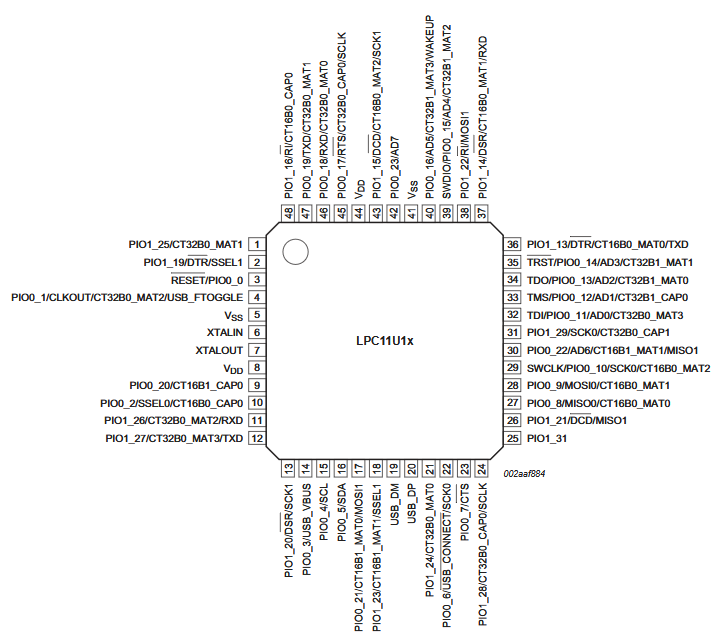

<details open>
<summary><b>Tabela Completa dos 48 Pinos do LPC11U14F</b></summary>

| Pino | Porta GPIO | Função / Conexão no Esquemático | Destino Físico |
| :---: | :---: | :--- | :--- |
| 1 | `PIO1_25` | `EXP10` | Header de Expansão J7.3 |
| 2 | `PIO1_19` | `SS` (SPI Slave Select) | Header de Expansão J6.5 |
| 3 | `PIO0_0` | `RESET` | Botão Reset SW1 com pull-up |
| 4 | `PIO0_1` | `ISP` (Bootloader de Gravação) | Botão táctil SW6 (Jumper de correção) |
| 5 | `VSS` | Terra Digital (`GND`) | Plano de Terra |
| 6 | `XTALIN` | Entrada do Oscilador de Quartzo | Cristal 12MHz Pino 1 / C25 (18pF) |
| 7 | `XTALOUT`| Saída do Oscilador de Quartzo | Cristal 12MHz Pino 3 / C26 (18pF) |
| 8 | `VDD` | Alimentação Positiva `+3.3V` | Barramento de 3.3V |
| 9 | `PIO0_20` | `EXP04` | Header de Expansão J5.4 |
| 10 | `PIO0_2` | Canal A do Encoder Rotativo (`SWA`) | Chave Bourns SW7.A1 |
| 11 | `PIO1_26` | Canal B do Encoder Rotativo (`SWB`) | Chave Bourns SW7.B1 |
| 12 | `PIO1_27` | Botão Integrado do Encoder (`S1`) | Chave Bourns SW7.1 |
| 13 | `PIO1_20` | Habilitação do LCD (`ENABLE` / `E`) | Conector LCD J9.6 (Jumper de correção) |
| 14 | `PIO0_3` | Proteção de Escrita da EEPROM (`WP`) | Pino 7 da EEPROM U5 |
| 15 | `PIO0_4` | Clock I²C (`SCL`) | Pino 6 da EEPROM U5 (Pull-up em 3.3V) |
| 16 | `PIO0_5` | Dados I²C (`SDA`) | Pino 5 da EEPROM U5 (Pull-up em 3.3V) |
| 17 | `PIO0_21` | Seleção de Registrador LCD (`RS`) | Conector LCD J9.4 |
| 18 | `PIO1_23` | Leitura/Escrita do LCD (`R/W`) | Conector LCD J9.5 |
| 19 | `USB_DM` | `EXP07` (Livre após corte do LCD) | Header de Expansão J5.7 |
| 20 | `USB_DP` | `EXP11` (Livre após corte do LCD) | Header de Expansão J7.4 |
| 21 | `PIO1_24` | Barramento de Dados LCD (`D5`) | Conector LCD J9.12 |
| 22 | `PIO0_6` | Barramento de Dados LCD (`D6`) | Conector LCD J9.13 |
| 23 | `PIO0_7` | Barramento de Dados LCD (`D7`) | Conector LCD J9.14 |
| 24 | `PIO1_28` | Barramento de Dados LCD (`D4`) | Conector LCD J9.11 (Jumper de correção) |
| 25 | `PIO1_31` | `EXP01` | Header de Expansão J5.1 |
| 26 | `PIO1_21` | `EXP08` | Header de Expansão J7.1 |
| 27 | `PIO0_8` | Linha SPI `MISO` | Header de Expansão J6.4 |
| 28 | `PIO0_9` | Linha SPI `MOSI` | Header de Expansão J6.3 |
| 29 | `PIO0_10` | Depuração SWD Clock (`SWDCLK`) | Header de Gravação J3.4 |
| 30 | `PIO0_22` | `EXP05` | Header de Expansão J5.5 |
| 31 | `PIO1_29` | Linha SPI Clock (`SCK`) | Header de Expansão J6.6 |
| 32 | `PIO0_11` | LED Indicador de Status 1 | LED D3.2 |
| 33 | `PIO0_12` | LED Indicador de Status 2 | LED D4.2 |
| 34 | `PIO0_13` | Tecla Navegação Baixo (`SW3`) | Chave Táctil SW5.3 |
| 35 | `PIO0_14` | Tecla Confirmação Enter (`SW2`) | Chave Táctil SW4.3 |
| 36 | `PIO1_13` | Tecla Navegação Cima (`SW1`) | Chave Táctil SW3.3 |
| 37 | `PIO1_14` | `EXP12` | Header de Expansão J7.5 |
| 38 | `PIO1_22` | `EXP09` | Header de Expansão J7.2 |
| 39 | `PIO0_15` | Depuração SWD Dados (`SWDIO`) | Header de Gravação J3.2 |
| 40 | `PIO0_16` | `EXP02` | Header de Expansão J5.2 |
| 41 | `VSS` | Terra Digital (`GND`) | Plano de Terra |
| 42 | `PIO0_23` | `EXP06` | Header de Expansão J5.6 |
| 43 | `PIO1_15` | `EXP13` | Header de Expansão J7.6 |
| 44 | `VDD` | Alimentação Positiva `+3.3V` | Barramento de 3.3V |
| 45 | `PIO0_17` | Linha Analógica ADC (`EXP03`) | Header de Expansão J5.3 |
| 46 | `PIO0_18` | Recepção Serial UART (`RXD`) | Saída TXD do transceptor FT232RL |
| 47 | `PIO0_19` | Transmissão Serial UART (`TXD`) | Entrada RXD do transceptor FT232RL |
| 48 | `PIO1_16` | `EXP14` | Header de Expansão J7.7 |

</details>

---

## Balanço Elétrico & Consumo de Potência

A estimativa do consumo total do protótipo foi calculada considerando correntes máximas em regime contínuo:

| Subsistema / Componente | Tensão ($V$) | Corrente Máx. Estimada ($mA$) | Potência Ativa ($W$) |
| :--- | :---: | :---: | :---: |
| Microcontrolador NXP LPC11U14F | $3.3\text{ V}$ | $100\text{ mA}$ | $0.330\text{ W}$ |
| Transceptor USB-Serial FT232RL | $3.3\text{ V}$ | $25\text{ mA}$ | $0.082\text{ W}$ |
| Memória EEPROM 24LC512 | $3.3\text{ V}$ | $3\text{ mA}$ | $0.010\text{ W}$ |
| Módulo Display LCD 16×2 (com Backlight)| $5.0\text{ V}$ | $120\text{ mA}$ | $0.600\text{ W}$ |
| LEDs Indicadores (3x) | $3.3\text{ V}$ | $39\text{ mA}$ | $0.129\text{ W}$ |
| Carga de Expansão / Sensores (Reserva Máx.) | $3.3\text{ V} / 5.0\text{ V}$ | $\approx 600\text{ mA}$ | $\approx 3.080\text{ W}$ |
| **Total Máximo Projetado em Carga Plena** | ‒ | ‒ | **$\approx 4.23\text{ W}$** |

---

## Orçamento e Custos de Fabricação

- **Lote de Componentes Eletrônicos (BOM):** **US$ 29,54** (aquisição em distribuidores autorizados como Mouser e Digi-Key).
- **Manufatura das Placas (JLCPCB):** **US$ 2,00** (lote com 5 unidades em FR-4 dupla face, 1.6 mm, 1 oz cobre, acabamento HASL).
- **Logística e Envio Internacional:** **US$ 3,30** (frete econômico internacional).
- **Investimento Consolidado:** **US$ 34,84** (custo unitário de fabricação da placa avulsa de apenas US$ 1,06).

---

## Guia de Compilação e Gravação

### 1. Ferramentas Necessárias
- **KiCad EDA:** Versão 9.0.2 ou superior.
- **IDE C/C++:** MCUXpresso IDE ou Eclipse com GCC ARM Embedded (`arm-none-eabi-gcc`).
- **Gravador Serial:** **Flash Magic** (ferramenta oficial NXP para microcontroladores LPC).

### 2. Procedimento de Gravação via Bootloader ISP
1. Conecte a placa ao computador utilizando um cabo Mini-USB conectado à porta serial FTDI.
2. Segure pressionado o botão **`SW6` (ISP)**.
3. Pressione e solte o botão **`SW1` (RESET)**.
4. Solte o botão `SW6`. O microcontrolador entrará no bootloader ISP gravado em ROM.
5. Abra o **Flash Magic**, configure:
   - **Device:** `LPC11U14/201`
   - **COM Port:** Porta serial atribuída ao chip FTDI
   - **Baud Rate:** `115200`
   - **Interface:** None (ISP)
   - **Oscillator (MHz):** `12`
6. No campo *Hex File*, selecione o binário compilado localizado em `Código/PBLE02/Release/PBLE02.bin`.
7. Marque *Erase blocks used by Firmware* e clique em **Start** para regravar o microcontrolador.

---

## Estrutura de Diretórios do Repositório

```text
.
├── Código/
│   └── PBLE02/
│       ├── .cproject
│       ├── .project
│       ├── PBLE02.fmx
│       ├── configFlashMagic.fmx
│       └── src/
│           ├── ctl/               # Lógica de Controle, FSM, Temporizador, Eventos
│           │   ├── event.c / .h
│           │   ├── output.c / .h
│           │   ├── stateMachine.c / .h
│           │   ├── timer.c / .h
│           │   └── var.c / .h
│           ├── hardware/          # Drivers dos Periféricos de Baixo Nível
│           │   ├── ADC.c / .h
│           │   ├── DAC.c / .h
│           │   ├── EEPROM.c / .h
│           │   ├── ENCODER.c / .h
│           │   ├── LCD.c / .h
│           │   ├── LED.c / .h
│           │   ├── Memoria.c
│           │   ├── RTC.c / .h
│           │   ├── Serial.c / .h
│           │   └── Teclado.c / .h
│           ├── cr_startup_lpc11xx.c
│           ├── I2C.c / .h
│           ├── programa.c / .h    # Ponto de entrada (main) e laço operacional
│           ├── sysinit.c
│           └── util.c / .h
├── KiCad/
│   └── Projeto_Final/
│       ├── bom/
│       │   └── ibom.html          # Interactive HTML BOM (iBOM dinâmico)
│       ├── Footprints/            # Bibliotecas de footprints locais
│       ├── Projeto_Final.kicad_pcb # Layout da placa de circuito impresso
│       ├── Projeto_Final.kicad_sch # Esquema elétrico hierárquico
│       ├── Projeto_Final.kicad_pro # Arquivo de projeto do KiCad
│       └── sym-lib-table
├── docs/
│   └── images/                    # Imagens, renderizações 3D, diagramas e fotos
│       ├── pcb_3d_top_corrected.png
│       ├── pcb_3d_bottom_corrected.png
│       ├── pcb_3d_top_original.png
│       ├── fig01_circuito_alimentacao.png
│       ├── fig02_circuito_processamento_original.png
│       ├── fig03_circuito_processamento_corrigido.png
│       ├── fig04_circuito_interacao_original.png
│       ├── fig05_circuito_interacao_corrigido.png
│       ├── fig06_circuito_perifericos_original.png
│       ├── fig08_circuito_comunicacao_original.png
│       ├── fig09_circuito_comunicacao_corrigido.png
│       ├── fig10_erc_erros_originais.png
│       ├── fig11_erc_verificacao_corrigida.png
│       ├── drc_errors_original.png
│       ├── drc_report_corrected.png
│       ├── mcu_pinout_lpc11u14.png
│       ├── firmware_fsm_state_machine.png
│       └── uml_software_architecture.svg
├── Documentacao.pdf               # Relatório técnico completo da disciplina (66 páginas)
├── uml.svg                        # Diagrama UML original em vetor
├── .gitignore                     # Filtro de arquivos temporários e binários de build
├── LICENSE                        # Licença MIT
└── README.md                      # Documentação técnica consolidada do repositório
```

---

## Licença

Este projeto é disponibilizado sob os termos da licença **MIT**. Para maiores informações, consulte o arquivo [LICENSE](LICENSE).
